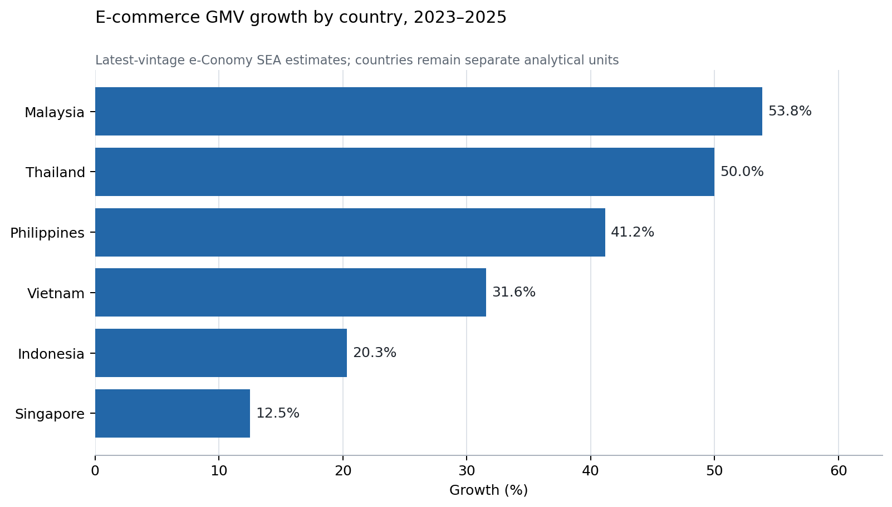

# Invisible Ledger

## Reconciling Transaction Activity Corporate Revenue and Business Records in Indonesian Digital Commerce

Christopher Ongko  
Master of Science in Finance  
Yuan Ze University  
September 2026

## Abstract

Digital commerce leaves several records of the same underlying activity. Platforms report transaction measures such as gross merchandise value, financial statements recognize revenue within the issuer's accounting perimeter, businesses maintain their own records, and statistical and tax institutions observe yet other quantities. These records are related but not interchangeable. This study builds a source-auditable account of Indonesia's digital commerce and asks how the interpretation of its transformation changes across these ledgers. The issuer analysis identifies 13 direct annual candidate periods and nine consecutive direct-candidate transitions across Tokopedia, Blibli, and Bukalapak, with conditional Grab and Shopee reconstructions retained separately. Three of the nine direct transitions have opposite transaction and revenue growth signs, and the median absolute difference between the two growth rates is 42.94 percentage points. Tokopedia provides the strongest Indonesia-aligned example: transaction value fell 8.90% from FY2022 to FY2023 while third-party net segment revenue rose 53.20%. A source reconciliation attributes 60.56% of the net-revenue increase arithmetically to lower customer incentives and 39.44% to higher gross revenue. Official BPS estimates provide a different view of the economy. From 2023 to 2024, nominal e-commerce transaction value rose 17.08%, estimated businesses rose 15.31%, and implied value per business rose 1.54%; the marketplace component rose only 1.45% while the non-marketplace component rose 20.57%. Published business-level BPS comparisons further show that marketplace users were more likely to maintain complete financial statements and less likely to rely on cash, although these relationships are observational. Separate ASEAN country histories and a global issuer panel corroborate recurring digital expansion and transaction-revenue non-equivalence without imposing a common business model or tax system. The evidence does not measure missing GDP, undeclared income, or unpaid tax. It shows instead that no single public ledger is sufficient to describe the scale, direction, composition, and institutional visibility of digital-commercial transformation.

**Keywords:** digital platforms; Indonesia; e-commerce; transaction value; revenue recognition; business records; economic measurement.

## 1 Introduction

Indonesia's digital economy can appear very different depending on the record used to observe it. A platform may record the total value of transactions coordinated through its system. Its financial statements recognize only the revenue attributable to the services or goods within its accounting perimeter. A merchant may maintain complete, partial, or no conventional financial statements. BPS estimates the number and value of e-commerce businesses across marketplace and non-marketplace channels. Tax authorities operate through legal reporting and withholding rules that do not necessarily reproduce any of those public datasets. All of these records describe parts of the same commercial system, but they answer different questions.

This distinction matters because platform-company revenue is often the most accessible public number. Revenue is important for investors and financial analysis, but it is not a direct measure of all commerce facilitated by a platform. Conversely, gross merchandise value or transaction value is not value added, participant income, tax liability, or welfare. Treating either quantity as a complete description can therefore produce a misleading account of digital transformation.

The research question is: **How does the interpretation of Indonesia's digital-commercial transformation change when activity is observed through platform transaction measures, issuer revenue, business participation and recordkeeping, official statistics, and tax-reporting institutions?** The study answers this question by reconciling several evidence modules rather than pooling them into one artificial sample.

The first module follows issuer-reported transaction and revenue measures over time. It tests whether the two measures provide the same directional account of platform growth and examines the mechanisms behind their divergence. The second uses official BPS statistics to decompose national e-commerce growth into changes in aggregate transaction value, the estimated number of participating businesses, implied value per business, and marketplace versus non-marketplace channels. The third uses published business-level BPS evidence to examine how marketplace users differ in financial records, legal status, training, payment methods, and dependence on e-commerce income. ASEAN country histories and a global platform panel then assess whether the broader phenomenon recurs beyond Indonesia while keeping each country's institutions and each issuer's business model separate.

Four findings emerge. First, transaction activity and issuer revenue do not always tell the same growth story. In the direct-candidate issuer evidence, three of nine consecutive transitions have opposite signs, and the typical gap between transaction and revenue growth is economically large. Second, those divergences are not one hidden quantity. Tokopedia and Blibli show that incentives, monetization, business mix, and accounting perimeter can materially alter recognized revenue even when transaction activity changes differently. Third, Indonesia's broader e-commerce expansion is not adequately described by marketplace-platform accounts. Between 2023 and 2024, most of the increase in the BPS national estimate came from non-marketplace channels, while growth in the estimated number of businesses accounted arithmetically for most of the increase in aggregate value. Fourth, digital traceability and conventional recordkeeping coexist unevenly. Marketplace users in BPS's published business-level comparison were more likely to have complete financial statements and much less likely to use cash, but the available evidence does not establish that marketplace use caused those differences or that the resulting records are linked to tax or statistical systems.

The paper's contribution is therefore not a new arithmetic ratio and not an estimate of an unrecorded economy. It is a source-auditable reconciliation of multiple observational systems. Platform economics explains why monetization need not move proportionally with facilitated activity. Revenue-recognition rules explain why similar commercial events can enter issuer accounts on gross or net bases. Statistical standards distinguish a digitally ordered transaction from the intermediation service supplied by a platform. Research on small-firm practices and third-party information explains why participant records and institutional linkage matter. Bringing those literatures together makes it possible to identify which apparent differences are ordinary measurement boundaries, which reflect economic mechanisms, and which remain unresolved information-linkage questions.

Indonesia is the main setting because it offers issuer histories, official business statistics, and an evolving platform-reporting architecture. The paper does not treat ASEAN as one fiscal or regulatory market. The regional evidence is used only to establish recurrence and heterogeneity. Likewise, the global issuer panel is purposively selected on disclosure availability and tests non-equivalence across business models, not the validity of Indonesian country allocations.

The remainder of the paper proceeds as follows. Section 2 develops the multi-ledger framework and positions the contribution. Section 3 describes the data and admission rules. Section 4 presents the issuer evidence. Section 5 reconciles mechanisms. Section 6 analyzes Indonesia's broader e-commerce population and channels. Section 7 connects business records to institutional visibility. Sections 8 and 9 present ASEAN and global corroboration. Section 10 discusses what the evidence changes and what it cannot establish. Section 11 concludes.

## 2 Conceptual framework and literature

### 2.1 One commercial event and several ledgers

A digitally mediated sale can generate several records. The platform may record order value, payment value, fees, discounts, refunds, and participant identity. The issuer's accounts recognize revenue and expenses according to contractual control and reporting perimeter. The merchant records sales, costs, and payment receipts with varying completeness. BPS observes the business through survey definitions and estimation procedures. Payment providers and tax authorities may hold additional records under separate legal and technical systems.

Table 1 distinguishes these ledgers. The rows are not competing estimates of one variable. They are records of different economic objects held by different observers.

**Table 1. Ledgers of digital commerce**

| Ledger | Primary object | Typical observer | What it can establish | What it cannot establish alone |
|---|---|---|---|---|
| Platform transaction | GMV, GTV, TPV, orders, payments | Platform and sometimes public investors | Scale of activity under the issuer's operating definition | Value added, participant income, or tax liability |
| Issuer accounting | Gross or net revenue, incentives, segment results | Issuer, investors, public researchers | Revenue recognized within the reporting perimeter | Total third-party commerce coordinated through the platform |
| Business record | Sales, costs, statements, payment method | Merchant or service provider | Conventional recordkeeping at the participant level | Completeness, accuracy, filing, or administrative access |
| Statistical | Survey-estimated businesses, transaction value, channels | BPS | Population and channel estimates under survey definitions | Transaction-level linkage to specific issuers or taxpayers |
| Administrative | Identity, turnover, withholding, reporting | Tax authority and designated intermediaries | Legally reportable or withheld amounts when implemented | Complete economic activity outside the rule's scope |

The empirical question is not whether one ledger is correct and another is wrong. It is whether a conclusion about scale, growth, composition, or visibility changes when the ledger changes. Ordinary differences of purpose are expected. A substantive measurement problem arises when users treat one ledger as a proxy for another without reconciling the boundary.

### 2.2 Platform economics and monetization

Two-sided-platform theory explains why transaction activity and platform revenue need not move proportionally. Platforms choose prices across participant groups, may subsidize one side, and monetize through commissions, advertising, logistics, subscriptions, travel, payments, or other services (Rochet and Tirole, 2003; Armstrong, 2006). Hagiu and Wright (2015) further distinguish a multi-sided platform from a reseller or vertically integrated firm by the control retained by affiliated participants. A change in transaction value can therefore occur alongside a very different change in platform revenue.

This paper does not estimate network effects or optimal platform pricing. It uses the literature to discipline interpretation: a revenue-to-transaction ratio is an outcome of business mix, pricing, incentives, and accounting scope. It is not a universal platform parameter that can be transferred across firms or countries.

### 2.3 Revenue recognition and comparability

IFRS 15 distinguishes a principal that controls a specified good or service before transfer from an agent that arranges for another party to provide it. The distinction affects whether gross consideration or a net fee enters revenue. Issuer changes in contractual responsibility can therefore change reported revenue without an equivalent change in the underlying volume of coordinated transactions. The SEC's guidance on key performance indicators similarly emphasizes clear definitions, calculation methods, assumptions, and changes in presentation.

Financial-statement comparability matters because users need to understand how similar economic events map into accounting numbers. De Franco, Kothari, and Verdi (2011) link comparability to the information environment of financial-statement users. The present study applies that concern to platform operating metrics: when do transaction value, gross revenue, net revenue, and comparable-basis revenue imply the same growth conclusion, and when do they not?

### 2.4 Digital-economy measurement

National-accounting and digital-trade frameworks make a crucial distinction between a transaction ordered through a digital platform and the intermediation service supplied by that platform. The OECD's Digital Supply and Use Table framework separates how a transaction is ordered, what product is supplied, and which industry produces it. The 2025 System of National Accounts and the Handbook on Measuring Digital Trade likewise distinguish the buyer-seller transaction from the platform service.

This distinction validates the need to compare ledgers but rejects a common shortcut. Transaction value minus platform revenue is not missing GDP because GDP measures value added, not gross sales. Digitalization creates practical challenges involving classification, cross-border activity, data lags, prices, and platform fees, but it does not make gross transaction value an alternative GDP measure (Ahmad and Schreyer, 2016; IMF, 2018; Byrne, Fernald, and Reinsdorf, 2016).

### 2.5 Business records and third-party information

Small-firm research shows that business practices and recordkeeping vary substantially and relate to firm performance, while the informality literature warns against collapsing heterogeneous businesses into a single hidden sector (McKenzie and Woodruff, 2017; La Porta and Shleifer, 2014; Ulyssea, 2018). Digital footprints can create information useful to financial intermediaries even when conventional records are limited (Berg et al., 2020).

Tax research provides a related but separate insight. Third-party information can improve verification and compliance when records are reported and linked to taxpayers (Kleven et al., 2011; Pomeranz, 2015; Slemrod, 2019; Garin et al., 2026). The OECD's platform-reporting model rules and Indonesia's PMK 37/2025 reflect this institutional logic. Yet the existence of a digital record does not prove that it is reported, matched, complete, or associated with an unpaid liability. The paper therefore treats institutional linkage as an evidence question rather than inferring it from the size of platform transactions.

## 3 Data and empirical design

### 3.1 Modular design

The study uses four empirical modules with different units of analysis. They are never added into one observation count.

1. **Indonesia issuer histories.** Annual platform or segment periods with a matched transaction measure and revenue measure. The analytical unit for growth is a consecutive transition within the same series and definition.
2. **BPS official evidence.** National year estimates, province-year observations, and published business-level comparisons. These describe the broader Indonesian e-commerce population rather than listed issuers.
3. **ASEAN corroboration.** Separate country histories and publication vintages. The unit is a country-year estimate within a source vintage.
4. **Global issuer corroboration.** Matched annual issuer histories across eight platform businesses. Growth is compared within issuers after screening known perimeter breaks.

The earlier FY2023 Grab, Tokopedia, and Shopee construction is retained as an appendix because it records the project's source lineage and assumption sensitivity. It no longer defines the main empirical contribution.

### 3.2 Issuer admission and evidence tiers

An issuer-period enters the candidate inventory only when transaction and revenue measures cover the same period; currency, unit, and definition are known; original, revised, and pro-forma bases are labelled; and material acquisitions or reporting breaks are flagged. Annual totals, quarters, segments, source inputs, and alternative publication vintages are not counted as independent observations.

The direct candidate inventory contains 13 economic periods: Blibli third-party retail for FY2019-FY2025, Bukalapak Group for FY2020-FY2023, and Tokopedia e-commerce for FY2022-FY2023. Twelve have positive revenue denominators; Blibli FY2019 has negative net revenue. Tokopedia FY2021 is excluded because full-year pro-forma transaction value was paired with revenue recognized only after the May acquisition. Bukalapak FY2024 is excluded because transaction value covers nine months while revenue covers twelve (GoTo, 2024; Global Digital Niaga, 2022-2026; Bukalapak, 2021-2024).

The tiers remain explicit. Tokopedia is a direct Indonesia-aligned segment. Blibli's third-party retail includes online commerce and tiket.com travel, so its geographic and business scope remain broader than a goods-only Indonesian marketplace. Bukalapak's group disclosures include overseas activity. Grab and Shopee country histories require allocation or external-estimate assumptions and are therefore conditional evidence rather than direct core observations.

**Table 2. Indonesia issuer evidence structure**

| Series | Candidate years | Evidence tier | Principal limitation | Role |
|---|---:|---|---|---|
| Tokopedia e-commerce | 2022-2023 | Direct Indonesia-aligned segment | Segment rather than explicit geographic line | Core mechanism case |
| Blibli third-party retail | 2019-2025 | Direct issuer scope pending | Includes online travel and changing mix | Longitudinal candidate |
| Bukalapak Group | 2020-2023 | Direct issuer scope pending | Group includes overseas operations | Longitudinal candidate |
| Grab Indonesia | 2021-2023 | Conditional country reconstruction | Country GTV derived from Group rate | Sensitivity only |
| Shopee Indonesia | 2022-2024 | Conditional country reconstruction | External country market estimate and company-wide rate | Sensitivity only |

### 3.3 Measures

For issuer i in year t, transaction growth is the percentage change in the issuer-defined transaction measure, and revenue growth is the percentage change in the matching selected revenue measure. The primary diagnostic is the difference between revenue growth and transaction growth, in percentage points. An opposite-sign transition occurs when one measure increases and the other decreases.

The analysis is descriptive. It does not pool monetary levels across currencies or estimate a common treatment effect. Medians summarize the observed candidate transitions, not an Indonesian platform population.

The earlier ecosystem ratio is retained only for lineage. If V denotes transaction value and R selected revenue, the ratio E = (V - R) / R equals 1 / t - 1, where t = R / V. It contains no information beyond the monetization rate. When a country quantity is derived using an assumed rate, the resulting ratio is mechanically imposed by that assumption.

### 3.4 BPS measures

The national BPS module uses nominal e-commerce transaction value and estimated businesses for reference years 2022-2024. Implied value per business is aggregate value divided by estimated businesses; it is not a firm-level mean from linked observations and is not interpreted as productivity. The 2023 and 2024 sales-media comparison uses directly reported marketplace amounts of Rp200.68 trillion and Rp203.58 trillion. Non-marketplace value is the published total less the direct marketplace component.

The published business-level evidence concerns reference year 2023 and compares 6,148 marketplace users with 33,588 non-marketplace users. Group differences and BPS's multivariate logistic result are reported as associations. The province analysis uses 38 common provinces and 36 complete first-difference observations, but cannot identify whether the same businesses both use marketplaces and maintain financial statements.

## 4 Issuer evidence

### 4.1 Transaction and revenue growth diverge

The nine direct-candidate transitions show that transaction and revenue measures are not interchangeable growth indicators. Revenue grows faster in six transitions and transaction activity grows faster in three. Three transitions have opposite signs. The median absolute growth-rate difference is 42.94 percentage points.

**Table 3. Direct-candidate transition results**

| Result | Count or value |
|---|---:|
| Candidate issuer periods | 13 |
| Positive-denominator periods | 12 |
| Consecutive direct transitions | 9 |
| Revenue grows faster | 6 |
| Transaction activity grows faster | 3 |
| Opposite-sign transitions | 3 |
| Median absolute growth divergence | 42.94 pp |

The three reversals are substantively different. Blibli's FY2020-FY2021 transaction value rose 14.86% while net revenue fell 28.08%. Tokopedia's FY2022-FY2023 transaction value fell 8.90% while net revenue rose 53.20%. Blibli's FY2024-FY2025 transaction value fell 1.89% while net revenue rose 12.07%. They establish non-equivalence, but not a common cause.

Including conditional Grab and Shopee histories yields an all-tier inventory of 17 levels and 12 transitions, with two opposite-sign transitions and a 42.02 percentage-point median absolute divergence. That inventory is useful as an evidence-tier sensitivity, but it is not a homogeneous Indonesia sample. The conditional cases produce larger median divergence partly because their country transaction values are constructed from monetization assumptions.

### 4.2 What the result means

The result is not simply that transaction value exceeds revenue. It is that the direction and magnitude of growth can change with the selected ledger. An observer using Tokopedia transaction value would describe contraction in FY2023; an observer using third-party net segment revenue would describe rapid expansion. Both statements are arithmetically correct, but they refer to different layers of the business.

This distinction is economically consequential for research using public issuer data. Revenue may reflect monetization, incentives, business mix, and accounting scope in addition to transaction activity. Transaction measures may include shipping, taxes, unpaid orders, travel, or other components depending on the issuer. A source-auditable analysis must therefore explain the divergence rather than rank platforms on an apparently common ratio.

## 5 Mechanisms behind issuer divergence

### 5.1 Tokopedia revenue bridge

Tokopedia provides the strongest reconciliation because the FY2022 and FY2023 segment accounts disclose gross third-party revenue, customer incentives, and net third-party revenue on a matched basis (GoTo, 2024).

**Table 4. Tokopedia e-commerce revenue reconciliation, IDR trillion**

| Component | FY2022 | FY2023 | Change |
|---|---:|---:|---:|
| Gross third-party segment revenue | 8.143 | 8.989 | 0.846 |
| Less customer incentives | 4.112 | 2.814 | -1.299 |
| Net third-party segment revenue | 4.031 | 6.175 | 2.144 |
| E-commerce transaction value | 273.146 | 248.836 | -24.310 |

The Rp2.144 trillion increase in net revenue equals Rp0.846 trillion of higher gross revenue plus Rp1.299 trillion of lower customer incentives, subject to rounding. Thus, 39.44% of the increase is arithmetically associated with higher gross revenue and 60.56% with reduced incentives. This is not a causal decomposition; it is an accounting bridge using reported components.

The reconciliation changes interpretation. Tokopedia did not simply earn more because it processed more transactions. Transaction value declined. Net revenue nevertheless rose because gross revenue increased and incentives fell. The transaction and revenue ledgers therefore disagree for a traceable economic and accounting reason.

### 5.2 Blibli business mix and promotions

Blibli's third-party retail disclosures provide a second mechanism. From FY2022 to FY2023, the Rp926 billion increase in net revenue reconciles to Rp664 billion higher revenue before promotions and Rp262 billion lower discount and direct-promotion deductions. From FY2024 to FY2025, third-party TPV fell 1.89%, net revenue rose 12.07%, and gross profit before discounts rose 13.93%. The issuer attributes the latter improvement mainly to a higher-margin online-travel mix and operating efficiency (Global Digital Niaga, 2023, 2026).

These comparisons also explain why Blibli cannot be treated as a pure Indonesian goods marketplace. The same inclusion of tiket.com that gives a useful direct issuer series creates business-mix variation. The appropriate response is not to discard the information or silently harmonize it. It is to retain the series with a scope flag and interpret the movement through the disclosed mix.

### 5.3 Accounting perimeter and metric definitions

Grab's disclosures provide an additional illustration of reporting perimeter. The issuer reported 65% FY2023 Group revenue growth, but stated that growth would have been 40% had the changed delivery business model already applied in the comparison year. For Deliveries, the corresponding figures were 80% reported and 30% on the comparable basis. The change reflected a shift in contractual responsibility with accounting consequences, not merely a cosmetic relabeling (Grab, 2024).

Across the global histories, revenue-to-transaction ratios range from launch-stage Shopee's very low 2017 level to Zalando's much higher principal-heavy perimeter. That range is not a performance ranking. It reflects different combinations of marketplace fees, advertising, travel, first-party sales, logistics, taxes, subscriptions, and financial services. Metric definitions are therefore part of the empirical object.

## 6 Indonesia's broader e-commerce transformation

### 6.1 Growth anatomy

Issuer histories observe selected companies. BPS estimates the broader population of Indonesian e-commerce businesses. The national evidence shows strong expansion, but its composition is different from an issuer-revenue story.

**Table 5. BPS national e-commerce growth anatomy**

| Measure | 2022 | 2023 | 2024 | 2022-2023 growth | 2023-2024 growth |
|---|---:|---:|---:|---:|---:|
| Transaction value, Rp trillion | 783.00 | 1,100.87 | 1,288.93 | 40.60% | 17.08% |
| Estimated businesses | 2,995,986 | 3,816,750 | 4,400,972 | 27.40% | 15.31% |
| Implied value per business, Rp million | 261.35 | 288.43 | 292.87 | 10.36% | 1.54% |

The decomposition is arithmetic, not causal. It cannot distinguish entry from improved survey coverage, survival, inflation, or changes among incumbent firms. Even so, it changes the descriptive account. Between 2023 and 2024, aggregate nominal value rose 17.08% while the estimated number of businesses rose 15.31%. Implied value per business rose only 1.54%. The expansion therefore appears much more participation-intensive than a revenue-only narrative would suggest.

### 6.2 Marketplace and non-marketplace channels

BPS's sales-media estimates show an even sharper distinction. Marketplace transaction value rose from Rp200.68 trillion in 2023 to Rp203.58 trillion in 2024, an increase of 1.45%. Non-marketplace value rose from Rp900.19 trillion to Rp1,085.35 trillion, an increase of 20.57%.

**Table 6. BPS transaction value by sales-media component**

| Component | 2023 Rp trillion | 2024 Rp trillion | Growth |
|---|---:|---:|---:|
| Marketplace | 200.68 | 203.58 | 1.45% |
| Non-marketplace | 900.19 | 1,085.35 | 20.57% |
| Total | 1,100.87 | 1,288.93 | 17.08% |

This finding does not imply that non-marketplace transactions are hidden or untaxed. BPS observes them through its statistical framework. It does show that listed marketplace accounts and marketplace GMV cannot stand in for Indonesia's full digital-commercial expansion. Messaging applications, social media, websites, and other channels occupy a large part of the measured economy.

The result restores the original motivation of Invisible Ledger in a defensible form. The commercial depth is not absent from all records; it is distributed across records. A narrow platform-company view misses participation and channel composition even when official statistics can estimate them.

## 7 Business records and institutional visibility

### 7.1 Published business-level comparisons

BPS's 2025 marketplace study compares 6,148 marketplace users with 33,588 non-marketplace users for reference year 2023. Marketplace users were more likely to have legal-entity status, complete financial statements, and information-technology training, and were far less likely to rely on cash.

**Table 7. Published BPS marketplace-user comparisons**

| Characteristic | Marketplace users | Non-marketplace users | Interpretation |
|---|---:|---:|---|
| Legal entity | 17.40% | 7.68% | Group difference; not causal |
| Complete financial statements | 28.63% | 12.25% | Records are not tax returns or audited quality |
| Received IT training | 8.49% | 2.83% | Selection and timing unresolved |
| Uses cash payment | 37.74% | 83.29% | Traceability indicator, not administrative linkage |
| Mean share of income from e-commerce | 56.90% | 41.85% | Group means; different populations |

BPS's multivariate logistic model reports an odds ratio of 1.846 for the association between financial-statement ownership and marketplace use, with a 95% confidence interval of 1.708 to 1.996. The outcome in that model is marketplace use. The result is not a causal effect of marketplaces on recordkeeping; more formal or capable firms may select into marketplaces.

The province analysis reinforces that caution. The marketplace-recordkeeping association is modest in 2023, approximately zero in 2024, and statistically uncertain in within-province changes. Province marginals cannot reveal whether the same individual businesses possess both characteristics. The business-level publication is therefore more informative than the ecological test, but licensed microdata would still be valuable for independent replication, richer controls, and cross-wave analysis.

### 7.2 Visibility to whom

The evidence supports a precise use of the word visibility. Issuer revenue is visible to investors and public researchers. Platform transaction flows are visible to the platform and partly visible publicly when disclosed. Business records are visible to the business and to BPS through survey response, but their completeness and quality vary. Tax visibility depends on legal reporting fields, identifiers, implementation, and matching.

Indonesia's PMK 37/2025 creates a legal bridge by assigning designated marketplaces seller-identity, turnover-linked withholding, deposit, and reporting responsibilities. That architecture demonstrates that platform company accounts and participant-level reporting are distinct information channels. It does not yet establish comprehensive operating linkage or compliance effects. Implementation evidence and record-level matching would be required for that conclusion.

**Table 8. Institutional visibility and remaining link**

| Record | Established visibility | Link not established by this study |
|---|---|---|
| Platform transaction | Platform; public when issuer discloses aggregate metric | Complete participant-level transfer to BPS or tax authority |
| Issuer revenue | Issuer, investors, researchers | Common denominator across business models |
| Merchant financial record | Merchant; BPS through survey | Accuracy, filing, and taxpayer linkage |
| BPS estimate | Public statistical aggregate | Exact overlap with issuer transactions |
| Marketplace tax report | Legal architecture under PMK 37/2025 | Comprehensive implementation, matching, and effects |

## 8 ASEAN corroboration without aggregation

The ASEAN evidence addresses recurrence, not sample enlargement. Latest-vintage estimates show e-commerce GMV increasing from 2023 to 2025 in Indonesia, Malaysia, the Philippines, Singapore, Thailand, and Vietnam. The median within-country increase is 36.4%, ranging from 12.5% in Singapore to 53.8% in Malaysia (Google, Temasek, and Bain, 2023-2025).

**Table 9. Latest-vintage e-commerce GMV growth by country**

| Country | 2023 USD bn | 2025 USD bn | Growth |
|---|---:|---:|---:|
| Indonesia | 59 | 71 | 20.3% |
| Malaysia | 13 | 20 | 53.8% |
| Philippines | 17 | 24 | 41.2% |
| Singapore | 8 | 9 | 12.5% |
| Thailand | 22 | 33 | 50.0% |
| Vietnam | 19 | 25 | 31.6% |

The countries differ in leading platforms, market concentration, tax objects, effective dates, and platform obligations. Indonesia's PMSE VAT and marketplace withholding architecture is not equivalent to Malaysia's service tax on digital services, Singapore's overseas-vendor regime, Thailand's VAT on electronic services, the Philippines' later digital-services VAT, or Vietnam's platform withholding for household businesses. These differences rule out a pooled ASEAN tax effect or a universal monetization rate.

Publication vintages add a second measurement result. Forty-five of sixty repeated digital-economy or e-commerce cells change between their earliest and latest publications; among changed cells, the median absolute revision is 7.14%. The measured past itself changes as methods and information are updated. This does not discredit market estimates, but it requires vintage-aware analysis rather than silent replacement.

## 9 Global corroboration across business models

The global module contains 48 matched issuer-years across eight platform businesses and 40 consecutive transitions. Eleven transitions are flagged for known perimeter breaks, leaving 29 clean-screened comparisons. Revenue grows faster in 22, transaction activity grows faster in seven, and four move in opposite directions. The median absolute growth divergence is 7.10 percentage points.

**Table 10. Global issuer corroboration**

| Measure | Result |
|---|---:|
| Matched issuer-years | 48 |
| Issuer businesses | 8 |
| Annual transitions | 40 |
| Clean-screened transitions | 29 |
| Opposite-sign clean transitions | 4 |
| Median absolute clean divergence | 7.10 pp |

The four clean opposite-sign transitions occur in Etsy 2021-2022, Etsy 2023-2024, eBay 2022-2023, and Zalando 2021-2022. These observations show that transaction-revenue non-equivalence is not unique to Indonesian issuers. They do not prove a common global effect, validate Grab or Shopee country allocations, or make differently defined transaction measures comparable in levels.

## 10 Discussion

### 10.1 What the integrated evidence changes

The integrated evidence supports a stronger conclusion than the earlier FY2023 reconstruction. Indonesia's digital transformation is not adequately summarized by one platform-company ledger. Issuer histories show that facilitated activity and recognized revenue can move differently. BPS shows that national expansion is closely associated arithmetically with growth in participating businesses and that non-marketplace channels account for most of the recent increase in transaction value. Business-level BPS comparisons show that marketplace users have more conventional records and lower cash reliance, while the province results warn against assuming a stable causal relationship. ASEAN and global evidence establish recurrence but also reveal different institutions, business models, and measurement vintages.

The findings are connected because each answers a different part of the same question. The issuer module shows why company revenue is an incomplete activity proxy. The BPS module reveals economic breadth and channel composition outside the issuer perimeter. The business-record module shows that participant observability varies. The institutional module asks whether those records are linked. ASEAN and global evidence show that the measurement problem travels, while its mechanisms and rules do not remain constant.

### 10.2 What remains invisible

The term Invisible Ledger does not mean that the economy leaves no record. The evidence suggests almost the opposite: digital activity leaves many records. The unresolved issue is whether those records can be reconciled across units, definitions, and institutional owners.

Three meanings of invisibility must be distinguished. First, an activity may be absent from issuer revenue even though it is present in a platform transaction ledger. Second, it may be visible only through aggregate statistical estimates rather than a public participant-level account. Third, records may exist separately without demonstrated linkage across platforms, businesses, payment providers, BPS, and tax authorities. The study establishes the first, documents parts of the second, and identifies but does not prove the third.

### 10.3 Implications for finance economic measurement and policy

For financial analysis, operating metrics should be read together with revenue definitions, incentives, business mix, and principal-agent treatment. A high or changing revenue-to-transaction ratio is not inherently better and cannot be compared across issuers without reconciling the perimeter.

For economic measurement, official statistics and issuer accounts are complements. Issuer disclosures can provide timely, detailed business information, while BPS can cover businesses and channels that listed-company accounts cannot represent. Neither should be stretched into the other's object.

For tax administration, platform records may provide useful third-party information, but the relevant empirical chain is participant identity, transaction coverage, reporting obligation, matching, filing, liability, and payment. Transaction value minus issuer revenue skips those links. The present evidence motivates studying the linkage; it does not estimate its fiscal result.

### 10.4 Limitations

The issuer sample is selected on disclosure availability and includes scope-pending businesses. Tokopedia is an Indonesia-aligned segment rather than an explicit country line; Blibli includes online travel; Bukalapak includes overseas activity. The conditional Grab and Shopee histories rely on country allocation assumptions and are not core direct evidence. Growth comparisons remain descriptive and may reflect price changes, acquisitions, strategic shifts, or reporting changes.

BPS national values are survey estimates, not linked firm panels. Implied value per business is aggregate arithmetic. The business-level comparisons are published results rather than independently reproduced microdata, and selection into marketplaces remains unresolved. ASEAN and global modules are purposive corroboration samples. The institutional analysis documents rules and evidence boundaries but not administrative performance. The event-study module remains exploratory and is not used for a market-response claim.

## 11 Conclusion

Digital commerce is not captured by one ledger. Platforms observe facilitated transactions, issuers recognize revenue, businesses maintain records, statistical agencies estimate populations and channels, and tax authorities operate through separate legal and reporting systems. These records overlap, but they do not measure the same object.

The source-auditable evidence shows that the choice of ledger can change the observed direction, magnitude, and composition of Indonesia's digital transformation. In direct issuer candidates, three of nine longitudinal transitions have opposite transaction and revenue growth signs. Tokopedia's strongest reversal is reconciled through higher gross revenue and lower incentives despite falling transaction value. BPS estimates show that recent national growth was participation-intensive and concentrated in the non-marketplace component. Published business-level evidence associates marketplace use with more complete financial records and lower cash reliance, but not causally. ASEAN and global histories show that digital expansion and transaction-revenue divergence recur under different institutions and business models.

The resulting claim is neither that GDP has failed nor that a transaction-revenue residual measures hidden income. Indonesia's digital transformation is present in economic records, but distributed across records with different units, scopes, definitions, and owners. A narrow public view can therefore underdescribe the economy's commercial depth even when the activity is recorded elsewhere. The practical contribution of Invisible Ledger is to show how those ledgers can be aligned, where the alignment changes an economic conclusion, and what additional participant-level linkage is required before stronger statistical or tax claims can be tested.

## References

Ahmad, N., and Schreyer, P. (2016). Measuring GDP in a Digitalised Economy. OECD Statistics Working Papers 2016/07.

Armstrong, M. (2006). Competition in two-sided markets. RAND Journal of Economics, 37(3), 668-691.

Berg, T., Burg, V., Gombovic, A., and Puri, M. (2020). On the rise of FinTechs: Credit scoring using digital footprints. Review of Financial Studies, 33(7), 2845-2897.

BPS-Statistics Indonesia. (2025a). E-Commerce Statistics 2024. Jakarta: BPS.

BPS-Statistics Indonesia. (2025b). Weighing the Benefits and Risks of Marketplace Use in E-Commerce in Indonesia. Statistical Data Story for Indonesia. Jakarta: BPS.

Bukalapak. (2021-2024). Annual and sustainability reports for fiscal years 2020-2024. Archived issuer-document copies and source locators.

Byrne, D. M., Fernald, J. G., and Reinsdorf, M. B. (2016). Does the United States Have a Productivity Slowdown or a Measurement Problem? Finance and Economics Discussion Series 2016-017.

De Franco, G., Kothari, S. P., and Verdi, R. S. (2011). The benefits of financial statement comparability. Journal of Accounting Research, 49, 895-931.

Garin, A., Jackson, E., Koustas, D., and Miller, A. (2026). The impact of third-party reporting on tax compliance: Evidence from gig workers. Journal of Public Economics, 260, 105697.

Global Digital Niaga. (2022-2026). Prospectus and annual results releases for Blibli fiscal years 2019-2025. Archived issuer documents and source locators.

GoTo Gojek Tokopedia. (2024). Annual Report 2023. E-commerce operating metrics and segment note 29.

Google, Temasek, and Bain & Company. (2023-2025). e-Conomy SEA reports. Country digital-economy and e-commerce estimates, retained by publication vintage.

Grab Holdings. (2024). Form 20-F and full-year 2023 results release. U.S. Securities and Exchange Commission and issuer investor relations.

Hagiu, A., and Wright, J. (2015). Multi-sided platforms. International Journal of Industrial Organization, 43, 162-174.

IFRS Foundation. (2021). IFRIC Update November 2021: Principal versus Agent Considerations.

International Monetary Fund. (2018). Measuring the Digital Economy. IMF Policy Paper.

Kleven, H. J., Knudsen, M. B., Kreiner, C. T., Pedersen, S., and Saez, E. (2011). Unwilling or unable to cheat? Evidence from a tax audit experiment in Denmark. Econometrica, 79(3), 651-692.

La Porta, R., and Shleifer, A. (2014). Informality and development. Journal of Economic Perspectives, 28(3), 109-126.

McKenzie, D., and Woodruff, C. (2017). Business practices in small firms in developing countries. Management Science, 63(9), 2967-2981.

Ministry of Finance of the Republic of Indonesia. (2025). PMK 37 Tahun 2025.

OECD. (2020). Model Rules for Reporting by Platform Operators with respect to Sellers in the Sharing and Gig Economy. Paris: OECD Publishing.

OECD. (2023). OECD Handbook on Compiling Digital Supply and Use Tables. Paris: OECD Publishing.

Pomeranz, D. (2015). No taxation without information: Deterrence and self-enforcement in the value added tax. American Economic Review, 105(8), 2539-2569.

Rochet, J.-C., and Tirole, J. (2003). Platform competition in two-sided markets. Journal of the European Economic Association, 1(4), 990-1029.

Slemrod, J. (2019). Tax compliance and enforcement. Journal of Economic Literature, 57(4), 904-954.

United Nations, European Commission, IMF, OECD, and World Bank. (2025). System of National Accounts 2025. Pre-edit version.

U.S. Securities and Exchange Commission. (2020). Commission Guidance on Management's Discussion and Analysis of Financial Condition and Results of Operations. Release Nos. 33-10751 and 34-88094.

Ulyssea, G. (2018). Firms, informality, and development: Theory and evidence from Brazil. American Economic Review, 108(8), 2015-2047.

## Appendix A Earlier FY2023 Indonesia construction

The earlier cross-section contains Grab Indonesia, Tokopedia e-commerce, and Shopee Indonesia for FY2023. Tokopedia uses a directly reported segment transaction/revenue pair. Grab uses direct Indonesia revenue and derives country transaction value from a Group monetization rate. Shopee combines an external Indonesia market estimate with Sea's disclosed company-wide service monetization rate. Under the retained 10.0% Shopee rate, the conditional arithmetic sum is approximately US$43.233 billion of transaction value, US$3.162 billion of selected revenue, and a US$40.070 billion difference.

This appendix preserves the source and calculation lineage. The combined value is not a national total, missing GDP, undeclared income, or unpaid tax. The ecosystem ratio is E = 1 / t - 1 and is mechanically determined for constructed cases. One-way and leave-one-platform-out sensitivities describe model and composition dependence; they are not additional observations.

## Appendix B Supporting evidence and exclusions

The quarterly accounting inventory contains 47 platform-quarter rows across Grab, GoTo, and Sea. It is retained as higher-frequency company evidence but is not added to the annual issuer N or treated as Indonesia country data. Event-study results remain exploratory because release timing, concurrent news, and the information set require further closure.

Tokopedia FY2021 remains excluded because full-year pro-forma transaction value and post-acquisition revenue cover different periods. Bukalapak FY2024 remains excluded because transaction value covers nine months and revenue covers twelve. Original and later publication vintages remain preserved; they are not counted as separate economic observations.

## Appendix C Reproducibility

The repository preserves the chain from issuer, BPS, ASEAN, regulatory, and market source documents to source extracts, analytical datasets, scripts, and reported outputs. Canonical counts are reported separately by module. The source archive, admission census, transition calculations, BPS decompositions, ASEAN vintage diagnostics, global issuer screens, and supporting figures can be regenerated from the documented scripts. Reproducibility establishes the calculation path; it does not remove the substantive limitations of sample selection, accounting scope, survey design, or causal identification.
