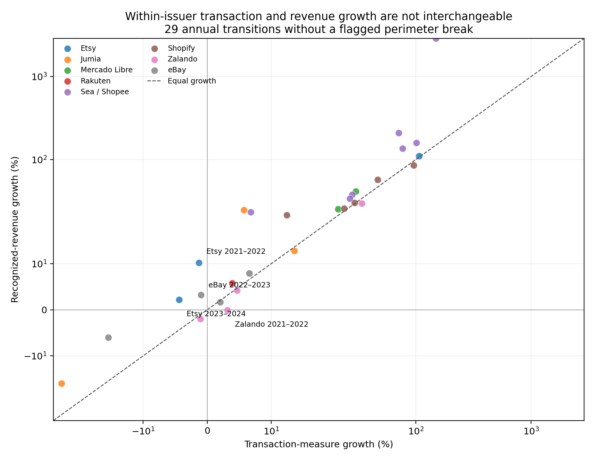

# Global e-commerce corroboration for *Invisible Ledger*

## Technical summary

The global extension shows that the paper's measurement problem is not unique
to one Indonesian reconstruction. Across 48 matched annual issuer records for
eight e-commerce platform businesses, transaction activity and recognized
revenue frequently grow at materially different rates. Among 29 consecutive
annual transitions without a flagged perimeter break, the median absolute
difference between transaction-measure growth and revenue growth is 7.10
percentage points. In four clean transitions, the two measures move in opposite
directions.

This is corroboration, not a global estimate. The module does not pool monetary
amounts across currencies, treat the firms as representative, or infer missing
GDP or tax non-compliance. Its result is narrower and more useful: corporate
revenue is not a stable one-for-one proxy for the commercial activity coordinated
through a platform, and the mapping varies systematically with business and
accounting perimeter.

## What is new in the evidence base

The module contains 48 unique issuer-year pairs across fiscal years 2017–2025:

| Issuer/segment | Matched years | Region/scope | Primary measurement issue |
|---|---:|---|---|
| Sea/Shopee e-commerce | 9 | Southeast Asia and other markets | Rapid monetization maturation and evolving revenue mix |
| Etsy consolidated marketplaces | 7 | Global | Marketplace portfolio acquisitions and disposals |
| Shopify commerce platform | 7 | Global | Subscription and merchant solutions revenue; logistics disposal |
| eBay marketplace | 6 | Global | GMV before returns/cancellations; Korea disposal |
| Zalando Group | 6 | Europe | GMV dynamically revised; revenue includes activity outside GMV |
| Jumia e-commerce group | 5 | Africa | First-party sales, currency effects, and country exits |
| Mercado Libre Commerce | 5 | Latin America | Commerce/Fintech separation and principal-agent shipping changes |
| Rakuten Domestic EC | 3 | Japan | Broad commerce/travel perimeter and retrospective realignment |

These are issuer/segment observations rather than country observations. They
therefore complement but do not replace the proposed longitudinal Indonesia
sample.

## Main empirical result: activity and revenue can tell different growth stories

The 48 annual records generate 40 consecutive within-issuer transitions. Eleven
are flagged because an acquisition, disposal, country exit, reporting-perimeter
revision, or principal-agent change affects the comparison. The clean summary
retains the other 29.

Of those 29 transitions:

- revenue grows faster than the transaction measure in 22;
- the transaction measure grows faster in 7;
- the median signed revenue-minus-transaction growth difference is 6.54
  percentage points;
- the median absolute difference is 7.10 percentage points;
- four show opposite signs.

The four opposite-direction clean transitions are particularly interpretable:

| Issuer | Transition | Transaction growth | Revenue growth | What the pair establishes |
|---|---:|---:|---:|---|
| Etsy | 2021–2022 | -1.29% | +10.18% | Revenue expanded despite a small fall in consolidated merchandise sales. |
| Etsy | 2023–2024 | -4.36% | +2.18% | Monetization/service revenue offset weaker merchandise activity. |
| eBay | 2022–2023 | -0.95% | +3.24% | Net revenue growth did not imply marketplace-volume growth. |
| Zalando | 2021–2022 | +3.18% | -0.09% | Merchandise activity increased while Group revenue was essentially flat/slightly lower. |

These observations do not show that revenue is wrong. Revenue and transaction
metrics measure different economic objects. They show why using one as a proxy
for the other can change the economic story.



The early Shopee history is also informative but should not dominate the
summary. Its revenue grew from a very small launch-stage base, so the 2017–2018
revenue-growth divergence is arithmetically extreme. The median is therefore
reported alongside, not replaced by, the maximum.

## Business-model heterogeneity is part of the finding

The observed revenue-to-transaction ratio ranges from approximately 0.22% for
launch-stage Shopee in 2017 to 74.63% for Zalando in 2020. This is not evidence
that one firm captures economic value more efficiently than another. The
perimeters differ:

- Shopify combines subscription and merchant-solutions revenue against orders
  facilitated by its infrastructure.
- Etsy combines marketplace and seller-services revenue against item value
  excluding shipping and net of refunds.
- eBay's GMV includes shipping and taxes and is not adjusted for returns or
  cancellations.
- Jumia includes first-party product-sales revenue, while its GMV is before
  discounts, cancellations, and returns.
- Zalando's revenue includes B2B and other revenues excluded from its GMV.
- Rakuten Domestic EC includes a broad portfolio that includes travel.
- Mercado Libre's retained revenue measure excludes Fintech but includes both
  Commerce services and product sales.
- Shopee's revenue perimeter and monetization mix changed substantially during
  platform maturation.

Accordingly, the global panel supports the advisor's warning in a broader setting:
different platform business models cannot be made comparable merely by giving
their transaction measures the same label. The definition map is not a
limitations appendix; it is necessary to interpret the empirical variation.

## Reporting vintages change the measured past

Zalando explicitly defines GMV as dynamically reported. The same economic year
therefore changes across later publications. For example, FY2024 GMV is EUR
15,296.2 million in the original FY2024 key figures and EUR 15,311.3 million in
the FY2025 comparative. FY2022 moves from EUR 14,797.9 million to EUR 14,788.7
million in the next report.

The canonical panel selects the latest available comparative vintage and keeps
the alternatives in `global_platform_vintage_diagnostics.csv`. These revisions
are small relative to the ASEAN market-estimate revisions, but they demonstrate
the same principle: a later estimate of an earlier period is not new economic
growth and must not be counted as another observation.

## How this strengthens the original ambition

The original *Invisible Ledger* motivation was that modern digital commerce can
be economically important while appearing differently across corporate,
participant, statistical, and tax records. The global panel cannot quantify an
unobserved economy. It does establish a prerequisite for that broader inquiry:
even within public issuer reporting, transaction activity and recognized
revenue do not provide interchangeable pictures of growth.

The stronger paper can therefore make a layered argument:

1. Indonesia supplies the main country-focused issuer and official-statistics
   analysis.
2. The BPS module measures the broader population and the limits of available
   business recordkeeping indicators.
3. ASEAN supplies six separate market histories and demonstrates country,
   platform, tax, and publication-vintage heterogeneity.
4. This global module shows that transaction/revenue divergence and disclosure
   dependence recur across very different e-commerce models.

The layers answer different questions. Their convergence supports a measurement
problem; it does not license adding their observations or monetary totals.

## Data-quality assessment

| Dimension | Assessment | Consequence |
|---|---|---|
| Source authenticity | Strong | All admitted values are transcribed from issuer filings or results materials; public URLs and local paths are retained. |
| Pair matching | Strong at issuer-year level | Transaction and revenue values cover the same fiscal year and retained issuer/segment perimeter. |
| Time coverage | Moderate to strong for corroboration | Eight issuers, 48 matched years, and 40 transitions; coverage is unbalanced and purposive. |
| Within-issuer comparability | Moderate | Eleven transitions are conservatively flagged for known perimeter breaks. |
| Cross-issuer comparability | Weak for level pooling; useful for definition analysis | Business models, transaction definitions, revenue categories, and currencies differ. |
| Geographic interpretation | Not country-specific | These observations cannot validate an Indonesia allocation or represent individual countries. |
| Statistical generalization | Limited | The issuers are selected because matching disclosures exist; no population sampling frame is claimed. |
| GDP/tax inference | Not supported | Transaction minus revenue is not value added, taxable income, unpaid tax, or omitted GDP. |

## Admission and exclusion discipline

Amazon, Alibaba, PDD Holdings, and Coupang are recorded as exclusions because a
continuous issuer-reported GMV series could not be matched to an equivalent
revenue perimeter for the retained period. Allegro remains a candidate pending
source-vintage extraction. Exclusion is preferable to filling missing years or
pairing non-equivalent measures.

The module's reproducible chain is:

```text
issuer filing/results document
  -> reviewed source transcription with locator and definition
  -> one matched issuer-year
  -> within-issuer annual transition
  -> scope-screened divergence summary and figures
```

## Bottom line

This extension does not rescue the thesis by inflating N. It strengthens the
paper by showing, with a materially broader and source-auditable history, that
the distinction between platform-mediated activity and company revenue has
empirical consequences across business models. The strongest global conclusion
is not that every platform hides the same amount of activity. It is that the
economic story depends on which ledger, perimeter, and publication vintage a
researcher observes.
