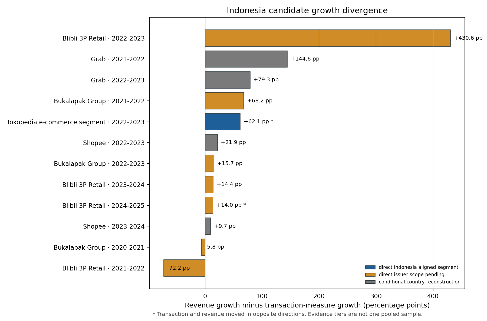
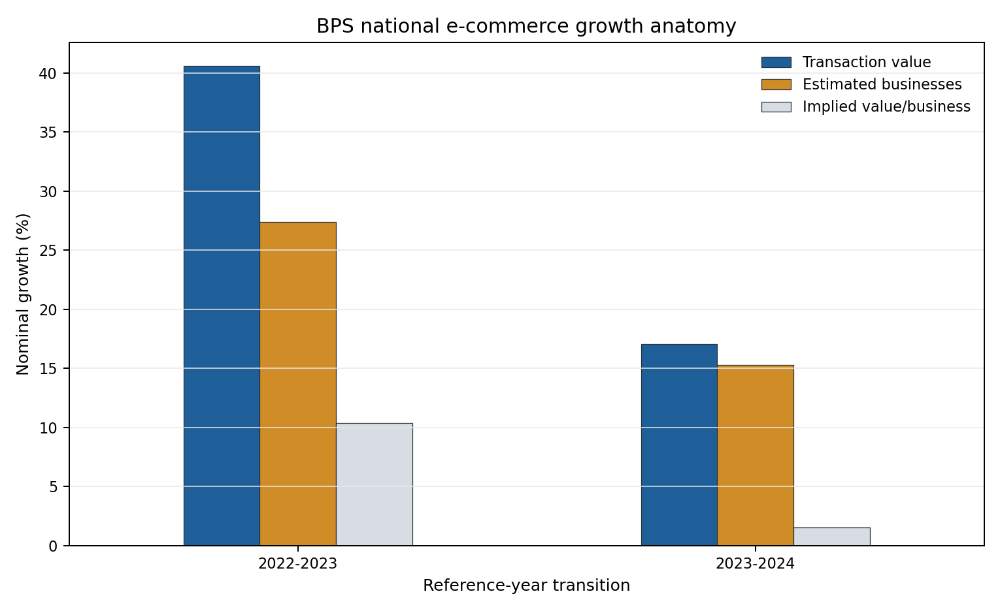
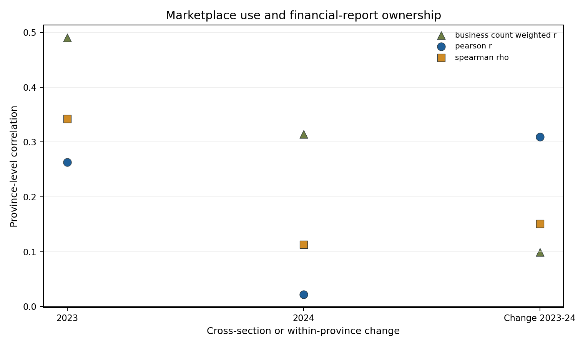

# First executed hypothesis tests for *Invisible Ledger*

## Technical summary

The first tests produce a mixed but useful result. The expanded Indonesia
candidate inventory contains 17 matched annual levels across
5 series and generates 12 consecutive
within-series transitions. Transaction and revenue growth differ materially:
the median absolute difference is 42.02
percentage points and 2 transitions
move in opposite directions. However, only the Tokopedia FY2022–FY2023
transition is currently in the direct Indonesia-aligned tier; the remaining
transitions are scope-pending issuer pairs or conditional country
reconstructions.

The official BPS aggregate evidence supports a second result. From 2022–2023,
nominal e-commerce transaction value grew 40.60%
while estimated businesses grew 27.40%,
leaving 10.36% growth in
implied value per business. From 2023–2024, the corresponding changes were
17.08%,
15.31%, and
1.54%. This is consistent
with expansion in business participation contributing importantly to aggregate
growth, but it is an arithmetic decomposition rather than a causal entry or
productivity result.

The province evidence does not validate a stable ecological relationship between
marketplace participation and financial-report ownership. The association
changes materially between the 2023 and 2024 cross-sections and is weak in
within-province changes. Separately, BPS has published business-level group
comparisons and an adjusted association for reference year 2023. Those results
are observational; licensed microdata remain desirable for independent
replication, richer conditioning, and cross-wave analysis.

## Revenue and transaction activity diverge, but evidence tiers matter

The analysis compares growth only within the same platform series. Monetary
levels are never added across companies or currencies. The executed candidates
are divided into three tiers:

- direct Indonesia-aligned segment: Tokopedia FY2022–FY2023;
- direct issuer pairs with unresolved scope: Blibli 3P Retail and Bukalapak Group;
- conditional country reconstructions: Grab and Shopee.

Across all three tiers, 10 transitions show
revenue growing faster and 2 show the
transaction measure growing faster. The opposite-sign cases are:

| series                       | transition   |   transaction_growth_pct |   revenue_growth_pct | evidence_tier                    |
|:-----------------------------|:-------------|-------------------------:|---------------------:|:---------------------------------|
| Blibli 3P Retail             | 2024-2025    |                    -1.89 |                12.07 | direct_issuer_scope_pending      |
| Tokopedia e-commerce segment | 2022-2023    |                    -8.90 |                53.20 | direct_indonesia_aligned_segment |

The figure is a candidate-coverage diagnostic, not an approved pooled sample.
Positive bars have faster revenue growth; negative bars have faster transaction
growth. Tokopedia FY2021 is excluded for period mismatch,
Bukalapak FY2024 is excluded because TPV covers nine months while revenue covers
twelve, and the Blibli and Bukalapak histories remain outside a strict
Indonesia-only tier.

## BPS growth is substantially associated with expansion in estimated businesses

| transition   |   total_transaction_value_growth_pct |   estimated_businesses_growth_pct |   implied_value_per_business_growth_pct | marketplace_component_growth_pct   | nonmarketplace_component_growth_pct   |
|:-------------|-------------------------------------:|----------------------------------:|----------------------------------------:|:-----------------------------------|:--------------------------------------|
| 2022-2023    |                                40.6  |                             27.4  |                                   10.36 | not available                      | not available                         |
| 2023-2024    |                                17.08 |                             15.31 |                                    1.54 | 1.45                               | 20.57                                 |

The chart separates growth in the aggregate nominal transaction estimate from
growth in the estimated business population and the residual implied value per
business. It does not identify firm entry, survival, inflation-adjusted output,
or productivity. The 2023 business count also retains a documented source
conflict; the executed value is the main-body figure consistent with BPS's
published growth calculation.

The 2023–2024 marketplace component grew approximately
1.45%, while the non-marketplace
component grew 20.57%. Both
components use directly reported BPS amounts. This
supports treating non-marketplace digital commerce as central to the national
measurement question rather than equating e-commerce with platform marketplaces.

## Province evidence does not validate a business-level recordkeeping effect

| specification          | year_or_change   |   province_n |   pearson_r |   pearson_p |   spearman_rho |   spearman_p |   business_count_weighted_r | interpretation                                                            |
|:-----------------------|:-----------------|-------------:|------------:|------------:|---------------:|-------------:|----------------------------:|:--------------------------------------------------------------------------|
| province_cross_section | 2023             |           36 |       0.263 |       0.121 |          0.343 |        0.041 |                       0.490 | Ecological cross-section; not a business-level marketplace effect.        |
| province_cross_section | 2024             |           38 |       0.022 |       0.897 |          0.113 |        0.499 |                       0.314 | Ecological cross-section; not a business-level marketplace effect.        |
| within_province_change | 2023-2024        |           36 |       0.309 |       0.066 |          0.151 |        0.379 |                       0.099 | Ecological first difference; still not a business-level or causal effect. |

The 2023 marketplace/financial-report association is modest (Pearson
`r=0.263`, `p=0.121`), while the
2024 cross-sectional association is close to zero (Pearson
`r=0.022`, `p=0.897`). The
within-province change association is positive but uncertain (Pearson
`r=0.309`, `p=0.066`;
Spearman `rho=0.151`,
`p=0.379`).

The instability is substantively important: province marginals cannot tell us
whether the same individual businesses both use marketplaces and maintain
financial reports. The national Fréchet bounds remain wide:

|   year |   marketplace_use_pct |   financial_report_ownership_pct |   joint_marketplace_and_reports_lower_pct |   joint_marketplace_and_reports_upper_pct |   neither_lower_pct |   neither_upper_pct | interpretation                                                                    |
|-------:|----------------------:|---------------------------------:|------------------------------------------:|------------------------------------------:|--------------------:|--------------------:|:----------------------------------------------------------------------------------|
|   2023 |                 17.80 |                            15.19 |                                      0.00 |                                     15.19 |               67.01 |               82.20 | Frechet bounds from separate national marginals; not a measured cross-tabulation. |
|   2024 |                 17.23 |                            17.15 |                                      0.00 |                                     17.15 |               65.62 |               82.77 | Frechet bounds from separate national marginals; not a measured cross-tabulation. |

These bounds show what is mathematically possible from the marginals; they are
not observed joint percentages.

## Hypothesis status after execution

| hypothesis                                                    | status                                                                               | evidence                                                                                                                                                                                              | boundary                                                                                                              |
|:--------------------------------------------------------------|:-------------------------------------------------------------------------------------|:------------------------------------------------------------------------------------------------------------------------------------------------------------------------------------------------------|:----------------------------------------------------------------------------------------------------------------------|
| H1 transaction and revenue growth can diverge                 | supported_in_candidate_inventory_not_final_sample                                    | 12 within-series transitions; 2 opposite-sign; median absolute difference 42.02 pp.                                                                                                                   | Evidence tiers include scope-pending and conditional cases; final Indonesia admission is unresolved.                  |
| H2 aggregate growth partly reflects more businesses           | supported_for_2022_2024_aggregate_decomposition                                      | 2023-2024 transaction value +17.08%, businesses +15.31%, implied value/business +1.54%.                                                                                                               | Nominal arithmetic decomposition; not causal entry or productivity evidence.                                          |
| H3 marketplace participation predicts financial recordkeeping | associated_in_published_business_level_evidence_not_validated_by_province_aggregates | BPS reports business-level differences and an adjusted association for reference year 2023; the 2023-2024 within-province change is unstable (Pearson r=0.309, p=0.066; Spearman rho=0.151, p=0.379). | Published association is not causal; licensed microdata would permit independent replication and richer conditioning. |
| H4 institutional linkage failure                              | not_yet_tested                                                                       | The repository documents distinct ledgers but not their actual administrative linkage.                                                                                                                | Requires implementation and identifier/linkage evidence, not only legal rules.                                        |
| H5 measurement choices can alter conclusions                  | supported_by_existing_measurement_modules                                            | Reporting vintages, revenue definitions, and business perimeters alter levels and growth comparisons.                                                                                                 | Economic consequence must be assessed comparison by comparison.                                                       |

## Scope, methods, and definitions

- Unit for issuer growth: one consecutive annual transition within a single
  platform/segment and stable selected revenue definition.
- Unit for BPS national decomposition: Indonesia reference year.
- Unit for BPS association: province-year or within-province first difference.
- Revenue and transaction growth are nominal and calculated within original
  currencies, so no FX conversion is required for rates.
- Pearson, Spearman, and business-count-weighted correlations are descriptive.
  No causal model is estimated.
- Annual totals, quarters, reporting vintages, and source inputs are not added
  into one observation count.

## Limitations and decision gates

1. The final Indonesia main sample is not advisor-approved.
2. Blibli includes travel and Bukalapak includes overseas activity.
3. Grab and Shopee country series remain model-dependent.
4. BPS province evidence is ecological; published business-level evidence is
   associative, while survey microdata would enable replication and richer
   conditioning.
5. The BPS national series contains a documented 2023 business-count conflict.
6. The tests do not measure missing GDP, tax liability, or undeclared income.

## Recommended next steps

1. Resolve Indonesia candidate admission and publication-vintage rules.
2. Recover gross revenue, incentives, and comparable-basis components for every
   admissible issuer transition.
3. Reconcile the published BPS business-level model and seek approved microdata
   access for replication and cross-wave extension.
4. Build the institutional visibility matrix only from verified reporting and
   implementation evidence.
5. Take the resulting sample census and the negative BPS province result to
   the advisor before restructuring the manuscript.
